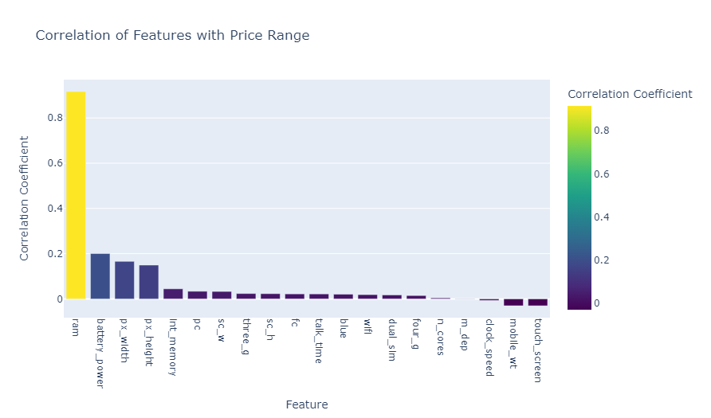

# Mobile Phone Price Prediction: In-Depth Analysis and Modeling 📱💡

Explore the intricacies of mobile phone pricing with this comprehensive notebook! 🚀 In this analysis, we delve into the following aspects:

- **Investigate Key Features:** Discover which features most significantly impact phone prices.
- **Clean and Preprocess Data:** Transform raw data into a model-ready format.
- **Visualize Insights:** Use advanced plots to uncover patterns and relationships in the data.
- **Build and Evaluate Models:** Apply machine learning techniques to predict mobile phone prices with precision.

This notebook is designed for data science practitioners and enthusiasts looking to enhance their skills through practical, hands-on data analysis and machine learning.

## Table of Contents

1. [Data Loading and Initial Exploration](#1-data-loading-and-initial-exploration)
2. [Data Cleaning and Preprocessing](#2-data-cleaning-and-preprocessing)
3. [Exploratory Data Analysis (EDA)](#3-exploratory-data-analysis-eda)
4. [Feature Engineering](#4-feature-engineering)
5. [Data Preparation for Modeling](#5-data-preparation-for-modeling)
6. [Model Building and Evaluation](#6-model-building-and-evaluation)
   - [6.1 Gradient Boosting Classifier](#61-gradient-boosting-classifier)
   - [6.2 Logistic Regression](#62-logistic-regression)
7. [Model Comparison and ROC Curve](#7-model-comparison-and-roc-curve)
8. [Conclusion](#8-conclusion)

## 1. Data Loading and Initial Exploration

We start by loading the dataset and performing an initial exploration to understand its structure and contents.

## 2. Data Cleaning and Preprocessing

Data cleaning involves handling missing values and preprocessing steps to prepare the data for modeling.

## 3. Exploratory Data Analysis (EDA)

We explore key features through visualizations to understand their distributions and correlations with the target variable.

### Feature Distributions

### Correlation with Price Range

## 4. Feature Engineering

New features are created to enhance the model's predictive power.

### Correlation with Engineered Features

## 5. Data Preparation for Modeling

Data is scaled and split into training, validation, and test sets for modeling.

## 6. Model Building and Evaluation

We build and evaluate machine learning models to predict mobile phone prices.

### 6.1 Gradient Boosting Classifier

We use Gradient Boosting to model the data and tune its parameters.

### 6.2 Logistic Regression

Logistic Regression is applied and optimized for better performance.

## 7. Model Comparison and ROC Curve

Model performance is compared using ROC curves to evaluate the classification ability.

## 8. Conclusion

🎉 Congratulations on completing this detailed analysis of mobile phone pricing! 📱💰

Key takeaways:

- **Feature Insights:** RAM and battery power significantly influence phone prices.
- **Feature Engineering:** Enhanced model performance by incorporating domain knowledge.
- **Model Performance:** Both Gradient Boosting and Logistic Regression models performed well, with Gradient Boosting slightly outperforming.

This notebook provides a solid foundation for predicting mobile phone prices. Feel free to experiment with additional features or advanced techniques to further improve prediction accuracy.

If you found this notebook useful, please consider giving it a thumbs up and sharing your feedback!
